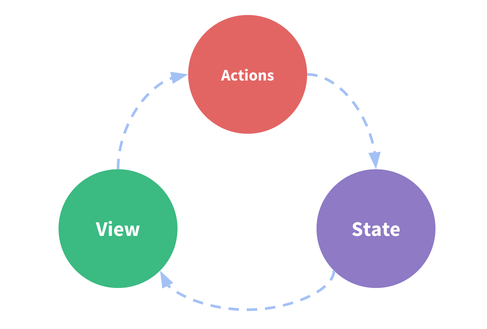

# Vuex

why vuex?

主要用於大型專案建構, 便於各頁面切換時，提取同一筆資料。
而vuex其核心，也是資料集中地，則在store。

## What is vuex?
* 單向資料流
* Flux design pettern
* 統一管理應用程式所有狀態
* 官方推薦項目之一

## How to use vuex?
### install vuex
```
yarn add vuex --save
```
### use vuex
open main.js 宣告使用vuex
```
//引入vuex
import vuex from 'vuex'

//告訴Vue使用vuex
Vue.use(Vuex)
```

### Flux概念
動作從action出發，進入store進行儲存，並改變其中的state，因為state改變，因此同步調整view(元件或頁面)。
因為這一串行為是不可逆的，因此又被稱為單向資料流。


### vuex執行說明


